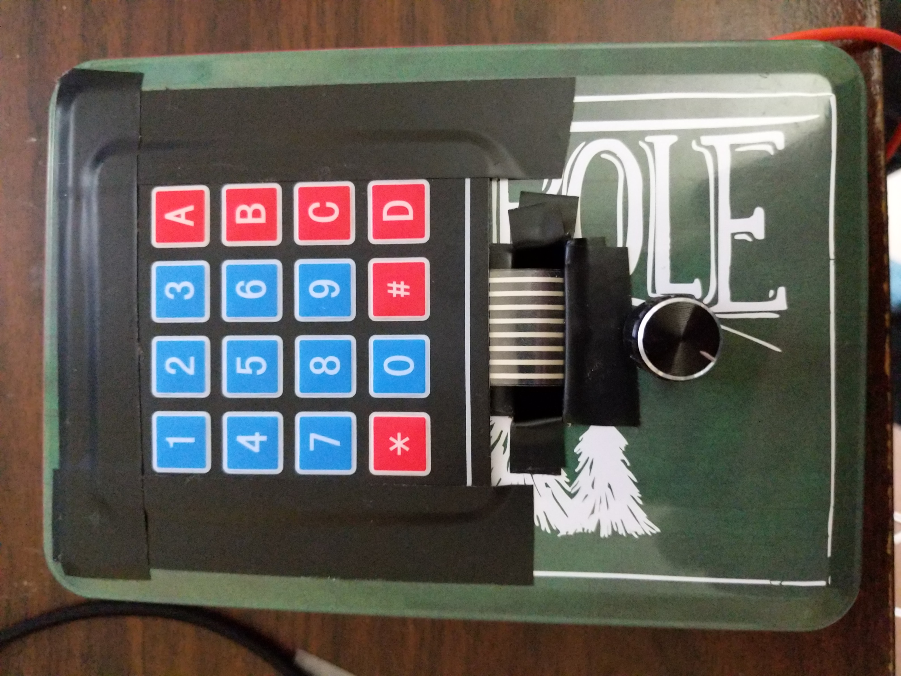

# Update 2/21/2021

I've finally designed a case for the mining controller!  It's nothing fancy, but it works and is fairly easy to print.  Here is a pic:

I've included all of the STL files to print the case, as well as the OpenSCAD files if you want to modify them.  Just clone the repo.  They are in the mining_controller_case directory.  Enjoy!

# MINING CONTROLLER
This software (and the hardware included in the parts list below) will allow you to create a 16 button mining controller for the game Star Citizen.  To save on pins and simplify design, I used a 4x4 keypad matrix.

# PARTS LIST
1 Arduino Leonardo or Micro - I would recommend the Micro as it is much smaller than the Leonardo and still has a good amount of pins.  Anything with a ATMega32u4 should work though.

1 10K OHM Linear Taper Rotary Potentiometer (10 turn) or similar Potentiometer.

1 4x4 Keypad Matrix [Amazon Search](https://www.amazon.com/s?k=4x4+keypad&i=electronics)

1 USB Micro to USB A cable

1 Project Box or housing to use as the controller housing.

Access to a soldering iron

Wires with appropriate headers or stripped and tinned for soldering.  I normally get a variety pack of breadboard jumper wires [Amazon Search](https://www.amazon.com/s?k=breadboard+jumper+wires&i=electronics).  To connect the wires to the potentiometer, I cut one end off, then soldered them to the holes in the pot.  That was better than using the female headers on the wires because they would occasionally slip off.  The female headers were fine though to the Arduino.

# REQUIREMENTS
To use this software, you will need the following libraries:

1.  Arduino Joystick Library by Matthew Heironimus, which you can download [here](https://github.com/MHeironimus/ArduinoJoystickLibrary)

2.  Arduino Keypad Library, which can be downloaded from the Arduino Library Manager.

# INSTRUCTIONS
To use the software, simply download the sketch and upload it to the Leonardo or Micro that you have connected to the PC.  The defaults are to use pin A0 to read the Potentiometer and digital pins 2-9 to read the 4x4 keypad.  I use a 50ms delay as default to debounce, yet still provide a long enough signal time so that the computer recognizes the button press.  You can change this to suit your needs.  

Once the software has been uploaded to the arduino, you should see a new joystick called Arduino Leonardo (or Leonardo Micro) in your list of USB controllers.  It should show as having an X axis and 16 buttons.  Once you connect the potentiometer and keypad matrix, you should be able to test everything from the properties menu in Windows and then use the controller in Star Citizen or any other games where you could use analog controls or extra buttons.

# NOTE
If you use the mining controller with other joysticks/controllers, it may change the order they are seen by Windows.  This means that you will need to remap your joysticks in game.  Unfortunately, this is a problem with Windows.

# PICTURE OF PROTOTYPE
Here is a picture of the prototype controller I built using the parts listed and software.  I hope to design a 3D printed case for it soon.  If so, I'll post the .stl files here.

